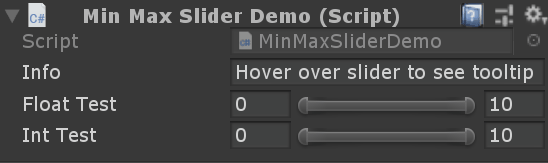

# SimpleMinMaxSlider for Unity



# Installation
Using Package Manager:
  1. Open package manager
  2. + -> Add package from git URL
  3. Paste: https://github.com/GucioDevs/SimpleMinMaxSlider.git#upm (remember the #upm at the end)

# Usage

Include namespace at the top of your script:
```C#
using GD.MinMaxSlider;
```

Code for the demonstration above:
```C#
[MinMaxSlider(0,10)] 
public Vector2 floatTest = new Vector2(2f, 8f);

[MinMaxSlider(0,10)]
public Vector2Int intTest;
```

Very simple and very handy!
